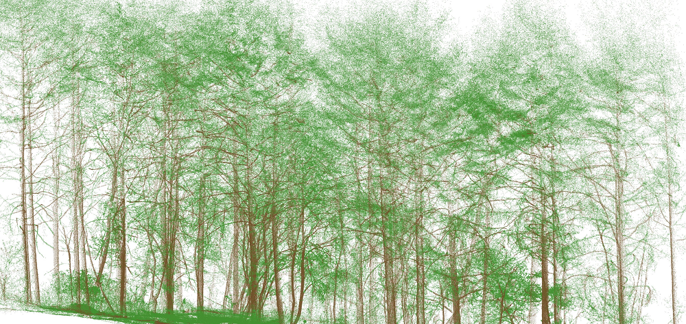
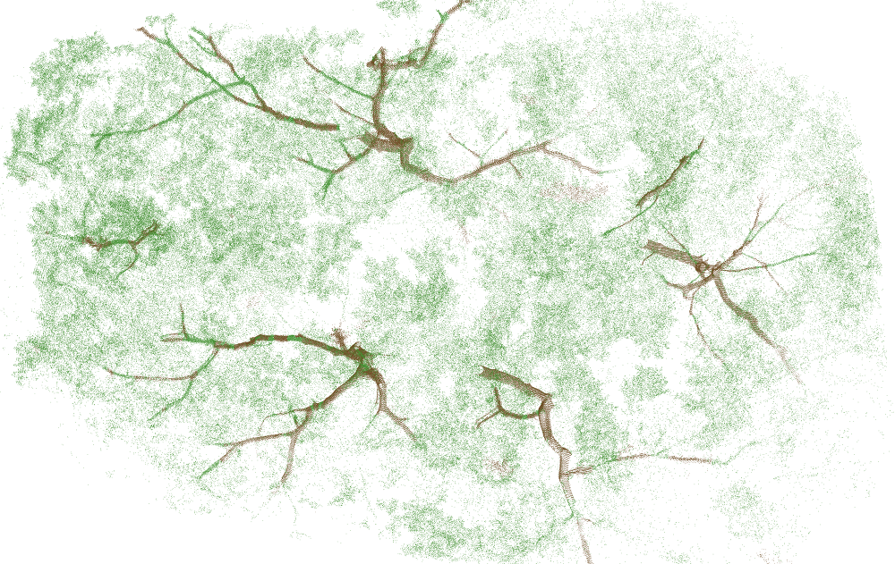
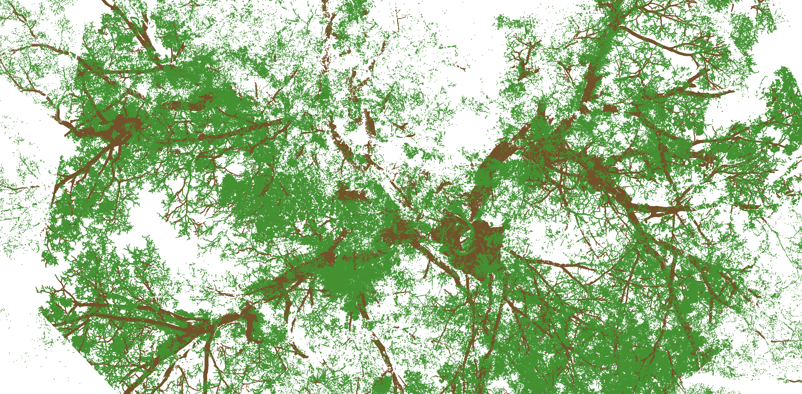

# LeWoS   
   
Tree leaf-wood classification from point cloud data   

# Usage  
There are many ways to use this tool.  
**(a) if you have Matlab installed:** 
Option 1. Call the entry level funtion "RecursiveSegmentation_release.m".  
Option 2. Type "LeWoS_RS" in Matlab workspace. This will open up an interface by calling the classdef "LeWoS_RS.m". This classdef file defines the interface.  
Option 3. Drag "LeWoS.mlappinstall" into Matlab workspace. This will install a Matlab App for you.   
**(b) if you don't have Matlab installed, and don't want to install it:** 
Run "LeWoS_installer.exe" for win64. If you need an excutable for other systems, please contact me.  (PS: Matlab Runtime 2019b is required. You can either install it in advance or do it during the installation of LeWoS.)

*Note that if you load an ascii point cloud with the interface, only space delimiter is supported. (Recommend to use las files)

# Examples

Plot-level separation 

Inside a crown

Very thin branches are difficult to detect

# Acknowledgement
This repo contains code from Loic Landrieu's repo on point-cloud-regularization (https://github.com/loicland/point-cloud-regularization), and Inverse Tampere's repo on TreeQSM (https://github.com/InverseTampere/TreeQSM).

# Bibtex

# Contact
Di Wang  
di.wang@aalto.fi
